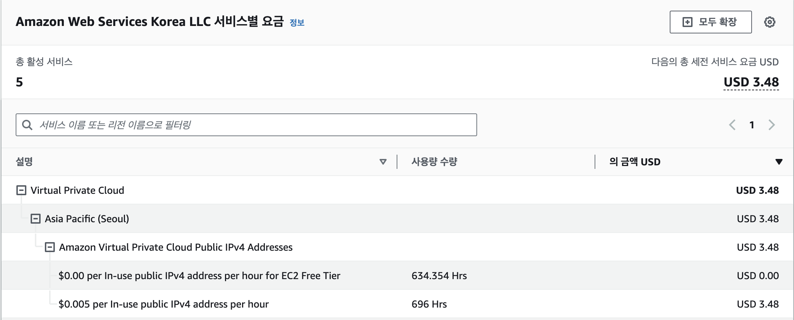
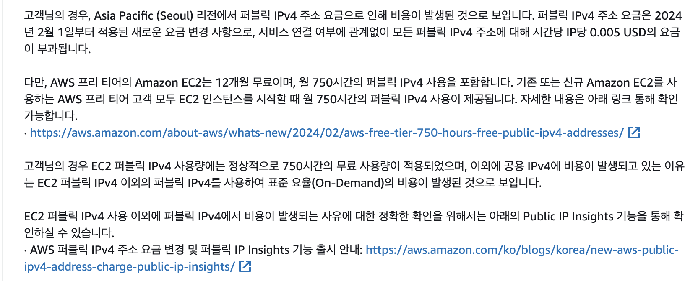

## 💰 AWS의 과금



이전 AWS 프리티어를 자주 이용하던 중 한달에 **3.48 USD**가 결제되는 것도 모르는채 방치해둔 인스턴스가 있었다..


---


## 🤔 잘 사용하던 AWS에 과금이 날라온 이유



문의를 해본 결과 2월부터 새로운 요금 변경 사항 때문에 퍼블릭 IPv4 주소에 대해서 **시간당 0.005 달러**의 요금이 발생하였다.


---

## ❓그럼 이제 AWS 프리티어도 공짜가 아닌가?


>💡 **정답은 1개의 퍼블릭 IPv4에는 **750시간 무료로 사용** 가능하다!**


나의 경우에는 EC2인스턴스에서 IPv4 1개, RDS에서 1개.

총 2개를 할당받아 사용했기에 과금이 발생한 것이다! 

</br>

## 🧑‍💻 개인서버 구축

많은 돈은 아니지만 환불을 받기 위해 문의하는 과정에서 많은 번거로움이 있었기에 나만의 서버를 구축해보고자 하였다. 

사실 집에 있는 컴퓨터를 통해 포트를 뚫고 서버를 구축한 경험이 있었지만, 하루종일 컴퓨터를 켜놓아야 한다는 단점이 있었다.🥲

<br/>

## ✅ 서버 조건

- **24시간 돌아가는 서버**
- **EC2 보다 좋은 성능**
- **무료 사용**

<br/>

이렇게 3가지 조건을 만족하는 서버를 구축해보고자 찾아보던 중 

안쓰는 공기계로 서버를 구축하는 것을 보게되었다.

재미있겠다 싶어서 바로 집에 있는 공기계를 이용하여 서버를 구축해 보았다!! 🥳
<br/>

```toc

```
