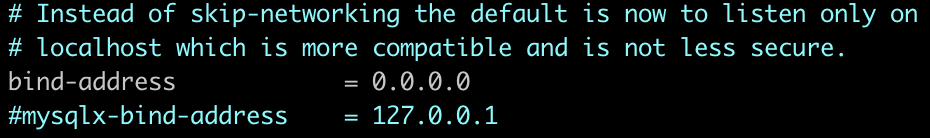
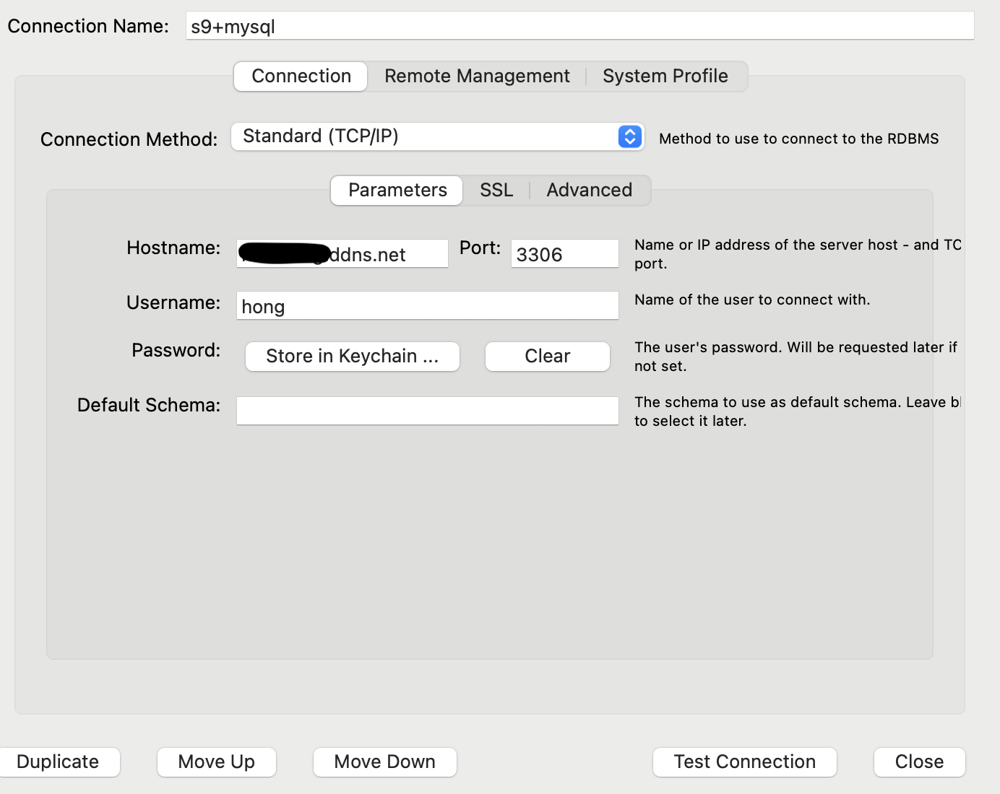
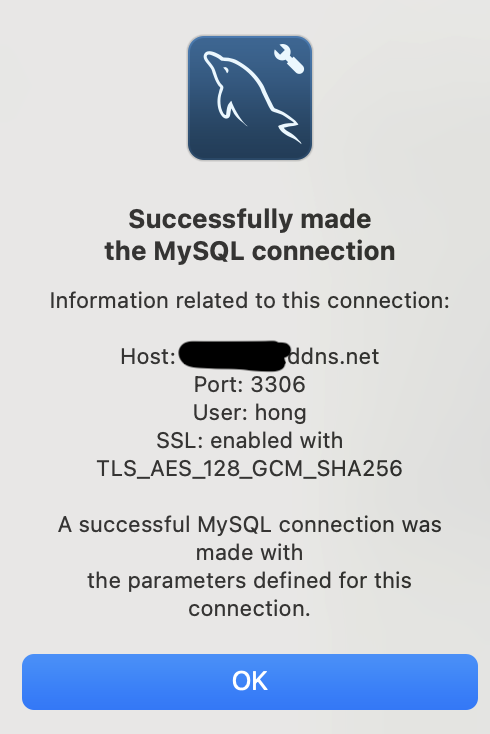

## ✅ 1. MySQL 다운로드
---

- **MySQL 설치**

```bash
sudo apt install mysql-server
```

<br/>

- **MySQL버전 확인**

```bash
mysql --version
```

<br/>

- **MySQL 시작**

```bash
sudo service mysql start
```

<br/>

⚠️ 만약 Mysql 시작 시 아래와 같은 에러가 발생할 경우

> **su: warning: cannot change directory to /nonexistent: No such file or directory**

<br/>

아래의 명령어를 실행해주자.


```bash
sudo service mysql stop

sudo usermod -d /home/<유저 이름>/ mysql
ex) sudo usermod -d /home/hong/ mysql

sudo service mysql start
```

<br/>


- pwd를 통해서 현재 디렉토리의 위치를 확인할 수 있다.
- termux를 사용하여 접속하면 root 디렉토리는

/home/<유저이름> 이다.

- 오류는 MySQL에서 권한이 없어 발생하는 오류이다.

<br/>

- **MySQL 접속**


```bash
sudo mysql
```

<br/>

## ✅ 2. User 생성 및 데이터베이스 생성
---
- **유저생성**

sudo mysql 명령어를 통해서 mysql에 접속한 상태로 진행하자.

```bash
create user <mysql유저이름>@'%' identified by 'mysql 비밀번호';

ex) create user hong@'%' identified by '1234';
```

mysql 유저이름 : mysql 로그인할 때 사용할 ID를 설정

mysql 비밀번호 : mysql 로그인할 때 사용할 PW를 설정

<br/>

- **데이터베이스 생성**

```bash
create database <데이터베이스 이름>;

ex) create database test;
```

<br/>

- **생성한 유저에게 데이터베이스 권한 부여**

```bash
grant all privileges on <데이터베이스 이름>.* to <mysql유저이름>'%';

ex) grant all privileges on test.* to hong@'%';
```

<br/>

## ✅ 3.  Mysql 외부포트
---
- **MySQL 외부 포트 열기**

sudo mysql 로 실행한 mysql을 exit로 나와 config파일을 수정하자.

```bash
exit
sudo vi /etc/mysql/mysql.conf.d/mysqld.cnf
```

<br/>

- **모든 IP 접속 가능하도록 설정**




bind-address의 값을 0.0.0.0으로 변경 후 저장.

<br/>

- **MySQL 재시작**

```bash
sudo service mysql restart
```

<br/>

## ✅ 4. MySQL Workbench 연결
---

**외부에서 MySQL Workbench를 이용하여 휴대폰 mysql DB에 접근해보자.**

<br/>


- **공유기 포트포워딩 설정**

공유기 관리자 페이지에 접속해서 **“포트포워딩”** 설정

Iptime 공유기, TP Link 공유기는 http://192.168.0.1/ 이 주소로 접속해서 설정하면 된다.


이전에 **4859**번 포트를 열었었는데, 추가로 **3306**번 포트를 추가로 열어주자!

IP 주소는 똑같이 휴대폰에 할당된 내부 IP를 적어주면 된다. ex)192.168.0.30

<br/>

- **MySQL Workbench 연결**



Connection Name : Mysql DB를 구분할 이름 입력

Hostname : 이전에 공유기 DDNS설정 시 입력한 도메인 입력 ex)domain.ddns.net

Username : MySQL 생성시 입력한 유저이름

Password - Store in Keychain.. : MySQL 생성시 입력한 PW

<br/>

## 🌟 Test Connectoin 클릭!
---



이렇게 Successful 문구가 나오면 성공한 것이다.

```toc

```