## ✅ 1. Termux 다운로드
---
Ubuntu환경을 사용하기 위해 Termux를 이용할 것이다.

안드로이드 10부터는 Google Play Store에서 Termux를 다운받을 수 없다. 그래서 아래 홈페이지에서 apk를 설치해주자.

https://github.com/termux/termux-app/releases


[termux-app_v0.118.0+github-debug_universal.apk](https://github.com/termux/termux-app/releases/download/v0.118.0/termux-app_v0.118.0+github-debug_universal.apk) 

파일을 다운하고 Termux가 설치되면 실행해주자.

---

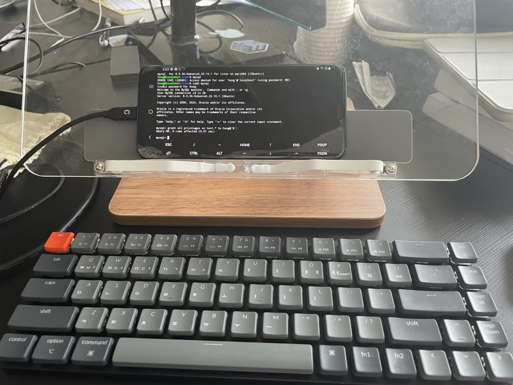

여기서 부턴 타자를 쳐야할 것들이 많기에 블루투스 키보드가 있으면 사진과 같이 연결하여 설치를 진행하면 좋다😊
<br>
<br/>

## ✅ 2. Ubuntu 설치
---
- **apt 패키지 update, upgrade**

```bash
apt update
apt upgrade
```

처음에는 **y**, 다음으로는 [default=N]이 나온다면 **n**을 입력한다.

- **proot, proot-distro 설치**

```bash
apt install proot
apt install proot-distro
```

루팅없이 리눅스를 실행할 수 있게 도와주는 툴을 설치한다.

- **Ubuntu 설치**

```bash
proot-distro list
proot-distro install ubuntu
```

이렇게 설치하면 Ubuntu 23.10 버전이 설치가 된다.
<br>
<br/>

## ✅ 3. Ubuntu 시작
---
- **ubuntu 로그인**

```bash
proot-distro login ubuntu
```

- **ubuntu 버전확인**

```bash
cat /etc/issue
```
<br>

## ✅ 4. User 추가 및 Tool 설치
---
- **apt 패키지 update, upgrade**

```bash
apt update
apt upgrade
```

위에서 ubuntu에 접속했으니 apt 패키지를 설치해주자.

- **vim 설치**

```bash
apt install vim
```
파일을 수정할 수 있도록 vim 에디터를 설치해준다.


첫 번째 time zones 옵션 → Asia 선택<br>
두 번째 city or region 옵션 → Seoul 선택
<br/>

- **User 추가**

```bash
adduser <계정이름>
ex ) adduser hong
```

비밀번호만 입력하고 나머지는 엔터를 눌러 넘어가자.

 ⚠️ 만약 adduser가 없는 명령어라 나온다면

```bash
sudo apt-get install adduser
```

이 명령어를 실행시킨 후 진행하면 된다.

<br/>

- **유저 목록 확인**

```bash
cat /etc/passwd
```

<br/>

- **sudo 설치 / 설정**

```bash
apt install sudo
vim /etc/sudoers # 설정페이지로 이동 후 수정
```

sudoers 설정으로 들어가 생성한 계정에 sudo 권한을 부여해준다.

만약 설정을 안하고 생성한 유저를 사용하면 sudo 명령어를 사용할 수 없다.

[ 계정 이름 ]    ALL=(ALL:ALL) ALL

ex ) hong     ALL=(ALL:ALL) ALL 

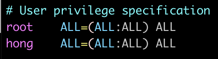
<br/>

- **vim 수정방법**
1. [ i ] : i를 눌러 편집모드로 전환
2. 수정을 완료 후 [ESC] 버튼
3. :wq!  → 모든 변경사항을 저장하고 밖으로 나감 (만약 저장을 안하고 나가려면 [ :qa! ])

<br/>

## ✅ 5. ssh 설치 및 계정 전환
--- 
- **ssh 설치**

```bash
apt install openssh-server
```

- **계정 전환**

```bash
su <계정이름>
ex) su hong
```

- **ssh 설정**

```bash
sudo vi /etc/ssh/sshd_config
```

<br/>

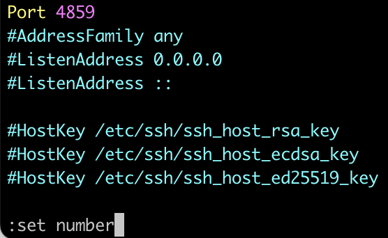

📌 sshd_config을 수정할 수 있는 vim에 접속해서 줄 라인을 볼 수 있도록 해주자.

[ :set number ] 을 입력해주고 Enter.

<br/>

**1. Port 번호 지정**

<LeftAlignedImage src="./phone3-1.png" alt="phone3-1"  />


#Port 22 로 주석처리 된 부분을 주석을 제거하고 (1 ~ 1023)을 제외한 포트번호를 지정한다.

<br>

**2. #PasswordAuthenticatoin yes 라인의 주석을 제거**


비밀번호 입력을 통해 ssh 접속 사용자를 인증한다는 부분이다.

1. :wq! 를 입력해 저장
<br/>


## ✅ 5. ssh 서비스 실행
---


```bash
sudo service ssh start
```
*Starting OpenBSD Secure Shell server sshd    [ OK ]   →  이렇게 뜨면 성공이다.

<br/>


## ✅ 6. ssh 접속
---

```bash
ssh <계정이름>@<ip 주소> -p <포트번호>
ex) ssh hong@192.168.0.30 -p 4859
```

계정이름 : 아까 adduser로 만든 계정입력

포트번호 : 위에서 Port번호 지정한 번호로 입력

IP 주소 : 휴대폰 Wi-Fi 정보에서 IP 값 설정

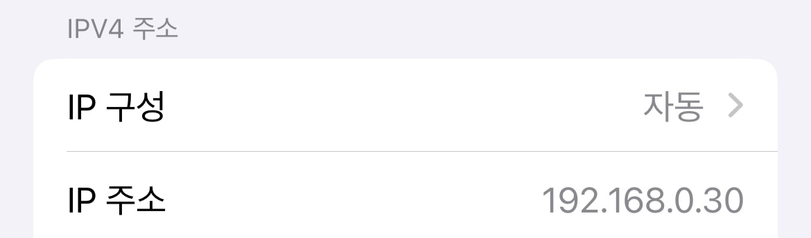


위의 IP주소는 Wi-Fi 공유기에서 휴대폰에 할당해준 **내부 IP 주소**이다. 그래서 같은 와이파이에 속해있어야만 ssh접속을 할 수 있다.

**외부에서 접속가능**하도록 하기 위해서 **포트포워딩 설정**을 해주자

</br>

## ✅ 7. 포트포워딩 설정 (외부 접속)
---
공유기 관리자 페이지에 접속해서 **“포트포워딩”** 설정

Iptime 공유기, TP Link 공유기는 http://192.168.0.1/ 이 주소로 접속해서 설정하면 된다.


이렇게 4859번 포트를 열었다.

IP 주소는 위의 휴대폰에 할당된 내부 IP를 적어주면 된다. ex)192.168.0.30

이렇게 한 후 

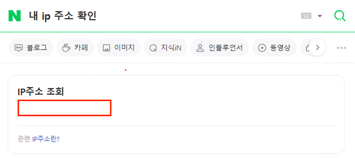

```bash
ssh hong@<네이버 검색 아이피> -p 4859
ex) ssh hong@113.124.21.12 -p 4859
```

</br>

## ✅ 8. 내부 IP 고정
---

와이파이에 연결되어 있는 휴대폰의 내부 IP가 아까는 192.168.0.30 이였지만 

일정 시간이 지나거나 재연결하게 되면 ip가 계속 바뀌기 때문에 **휴대폰에 IP를 고정**시켜야 계속 사용가능하다.

그래서 휴대폰에 고정 내부 IP를 설정해주도록 하자.

공유기 관리자 페이지([http://192.168.0.1](http://192.168.0.1/))에 접속하여 **수동 IP 할당 설정**을 한다.

공유기 마다 다른데 **“DHCP 설정”** 부분을 찾아보면 된다.

- **TP-Link 공유기**

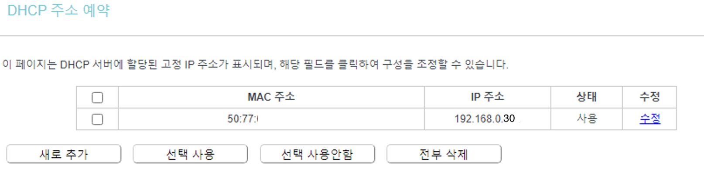

DHCP → 주소 예약 → 새로 추가

<br/>

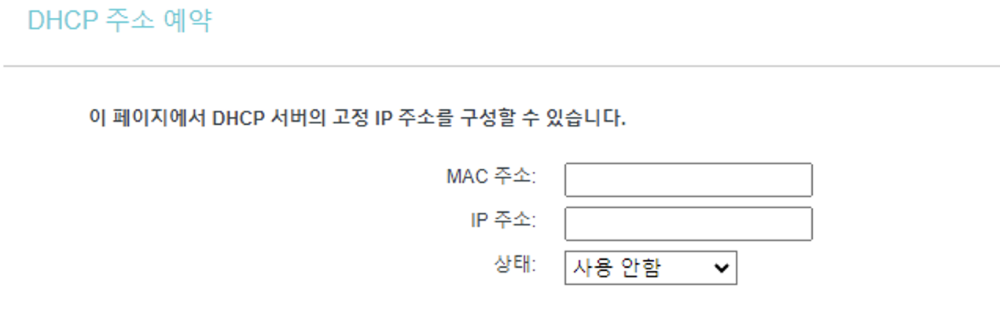


MAC 주소 : 휴대전화 MAC 주소 입력

→ 휴대폰 Wifi에 들어가면 “MAC 주소 유형” 의 값을 “랜덤 MAC” → “휴대전화 MAC”로 변경

→ 바뀐 MAC 주소 확인 후 입력칸에 입력

</br>

IP 주소 : 아까 할당받은 휴대전화 Wi-Fi IP 주소 ( 다른 주소를 할당해도 됨 ) 

ex ) 192.168.0.30

- **Ip-time 공유기**

참고링크 : [아이피 타임 공유기 내부 아이피 주소 고정해서 사용 하기 - insideBOX](https://comeinsidebox.com/fixed-ip-address/)

<br/>

**🥳 여기까지 완료했으면 휴대폰에서 Wi-Fi를 껐다가 연결해도 똑같은 IP주소를 할당 받을 것이다!** 


</br>

## ✅ 9. DDNS 설정
---


```bash
ssh hong@113.124.21.12 -p 4859
```

이전까지 휴대폰에 접속하려면 IP주소를 직접 입력해야 접속가능했다.. 

더 편하게 접속하는 방법이 없을까? 🤔  → DDNS를 설정하여 [naver.com](http://naver.com) 처럼 도메인을 이용하여 접속해보자!

- **Ip-time 공유기**
    
    →  무료로 DDNS 서비스를 지원한다!  ex) [example.iptime.org](https://comeinsidebox.com/fixed-ip-address/)
    
    [[ipTIME] DDNS 설정으로 외부에서 쉽게 공유기에 접속하기](https://luckygg.tistory.com/271)
    

- **TP-Link 공유기**
    
    → 한달간 무료로 DDNS를 지원해준다 ( [www.no-ip.com](http://www.no-ip.com/) ) 
    
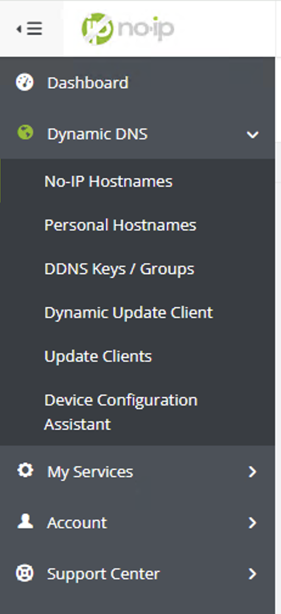
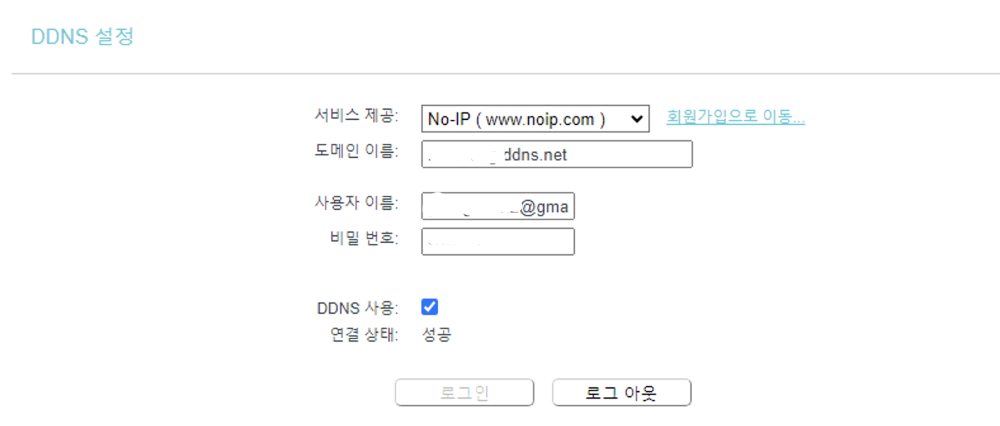

1. [www.no-ip.com](http://www.no-ip.com/)  사이트에 회원가입 후 
2. Dynamic DNS → NO-IP Hostnames 클릭
3. Create Hostname을 클릭하여 호스트네임을 생성한다.
4. TP-Link 사이트 접속
5. 서비스 제공 : No-IP로 설정
6. 도메인 이름 : [www.no-ip.com](http://www.no-ip.com/) 에서 발급받은 도메인 이름 
7. 사용자 이름 : [www.no-ip.com](http://www.no-ip.com/)  가입할 때 사용한 ID
8. 비밀번호 : [www.no-ip.com](http://www.no-ip.com/)  가입할 때 사용한 PW
9. 로그인 버튼 클릭! 끝

---

이제 SSH 접속을 할 때, **IP주소** 대신  **도메인 이름** 으로 접속할 수 있다.

```bash
ssh <사용자 이름>@<설정한 도메인 이름> -p <포트번호>

ssh hong@113.124.11.12 -p 4859   ->  ssh hong@domain.ddns.net -p 4859
```

<br/>

- 🎉 **접속 결과 사진**

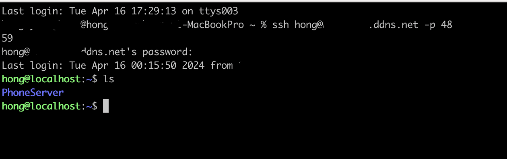

<br/>

## ✅ 10. SSH Config 설정 ( 더 쉽게 접속하는 방법 )
---

위에서 **IP주소**를 외우지 않아도 **도메인**으로 SSH에 접속할 수 있도록 설정하였다.

하지만 **유저이름 + 도메인 + 포트번호** 입력하는 것도 번거롭다.. 그래서 이를 더 단순화 시켜 ssh에 접속해보자!

</br>

**💻 Mac 기준입니당**

```bash
cd ~.    # 홈 디렉토리로 이동
ls -al   # 현재 디렉토리에서 모든 파일 보기
```

그럼 파일 목록이 보이는데  **“.ssh”** 폴더가 있는지 확인하자!


- config 파일 생성 ( 기존에 .ssh 폴더 안에 config가 없을 경우에 자동생성)

```bash
vi ~/.ssh/config
```

</br>
- [ i ] 를 입력하여 파일 수정모드로 변경

</br>
</br>

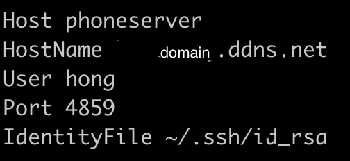


```bash
Host      <접속할 이름>
HostName  <ddns설정한 도메인>
User      <adduser로 생성한 유저이름>
Port      <열어준 포트 번호>
IdentityFile ~/.ssh/id_rsa. #ssh 공개키로 접속 / 기본 값은 프로토콜에 따라 결정. ( ~/.ssh/id_rsa or ~/.ssh/id_dsa)
```

- 수정 후 파일저장
1. ESC 클릭 
2. :wq! 입력
</br>

- ssh config 권한 설정

```bash
 chmod 440 ~/.ssh/config
```
</br>

- **끝** 🎉

```bash
ssh <Host 이름>
ex) ssh phoneserver
```
<br/>

```toc

```