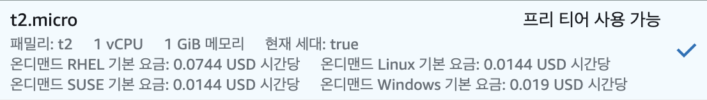
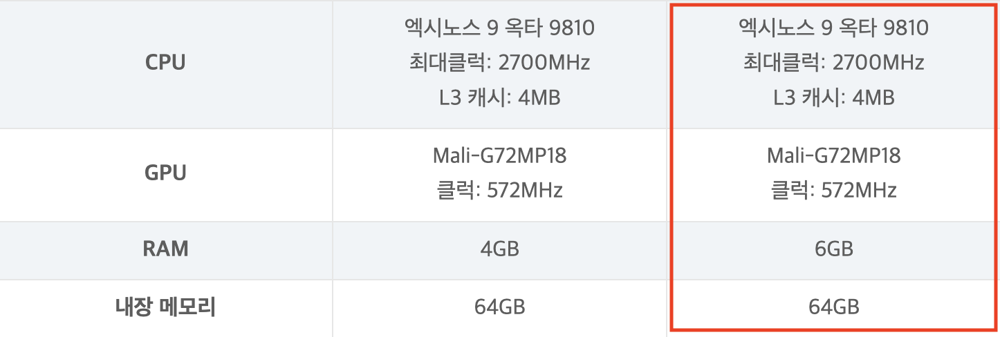

## 📱 갤럭시 s9+
---
집에 돌아다니는 **갤럭시 s9+** 를 사용하여 서버를 구축하고자 기존에 남아있는 데이터를 초기화 시킨 후 진행하였다.

데이터를 초기화하는 방법은 “**갤럭시 공장초기화**”를 검색 후 따라해보자!

<br>

## 📊 EC2 vs 갤럭시 s9+
---

### 💻 EC2



EC2를 이용하면서 CPU 사용량이 100%로 튀면서 다운되는 현상이 종종있었다. 이런 경우에는 메모리 사용량을 초과해서 발생하는데

EC2 프리티어가 가능한 t2.micro의 메모리는 무려.. **1GB**이다!

이러니 어느순간 서버가 다운이되어 접속도 안되는 문제가 발생했었던 것이다.
<br/>
<br/>

### 📱 갤럭시 s9+



성능을 비교해보자면 4년전에 사용하던 휴대폰인데도 EC2 보다 더 뛰어난 성능을 가지고 있었다!

## 다음 글 부터 본격적인 서버구축 시작! 🚀
<br/>

```toc

```